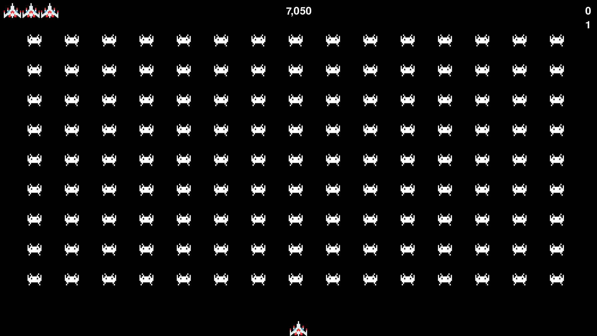

# Alien Invasion
Space Invader replica game implemented in Python using object oriented programming.

# Spaceship can
* Move left and right within the dimensions of the screen.
* Shoot bullets.

# Alien fleet can
* Move from left to right and move down when hit edge of screen.
* Detect bullets, spaceship and bottom of screen.

# Rules implemented
* Only a specified number of bullets are allowed on screen at one time.
* When an alien detects a bullet it's destroyed.
* When an alien detects the rocketship or the bottom of the screen a life is lost, the game pauses and then restarts with a full alien fleet.
* When the user loses his three lives the game ends.
* When all aliens have been destroyed the next level begins, with increased difficulty.

# Additional features
* All-time high score stored within highscore.txt.

# GUI
* Play button presented to user at beginning of game. Once game has started the button and cursor are hidden.
* Number of lives remaining is displayed in top left of screen.
* All-time high score displayed in top middle of screen.
* Current score and level number displayed in top right of screen.

# Copyright warning
* This project was developed for learning purposes only.
* The images and sound effects are not mine and may need attribution.
